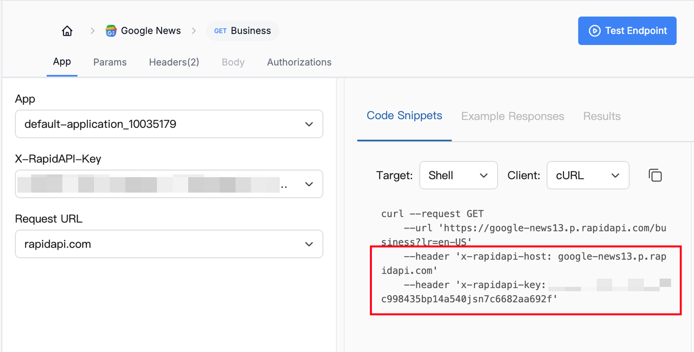
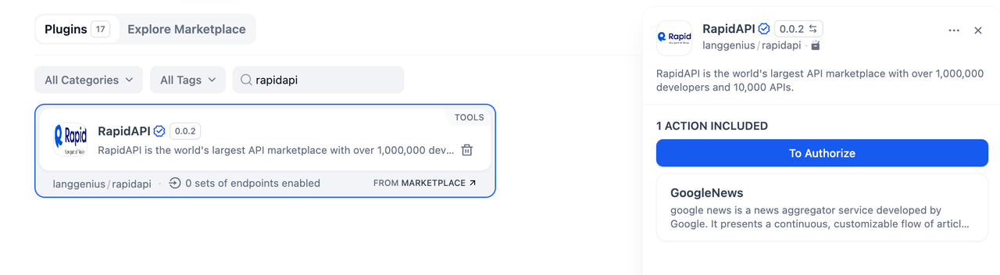
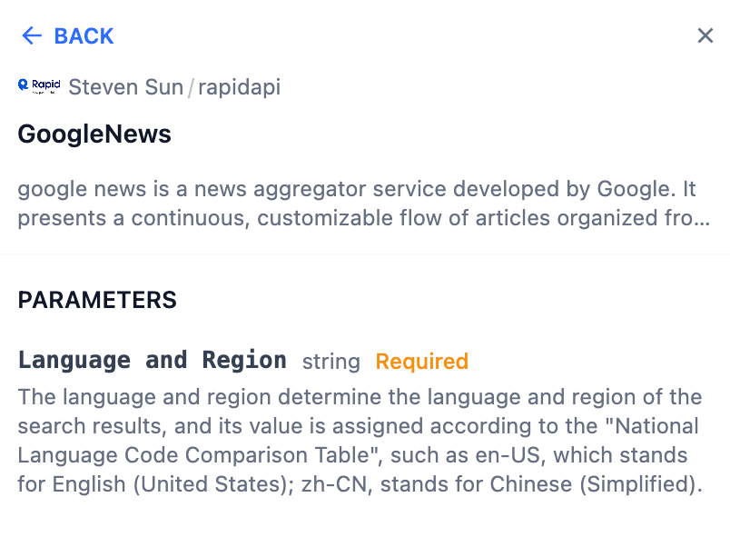
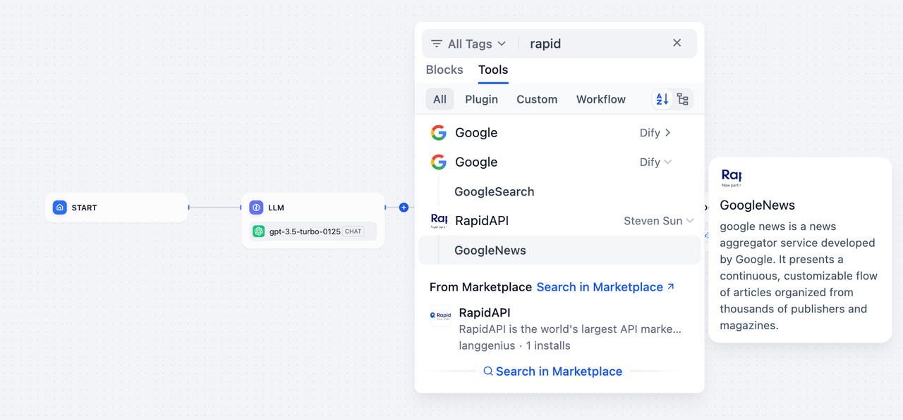
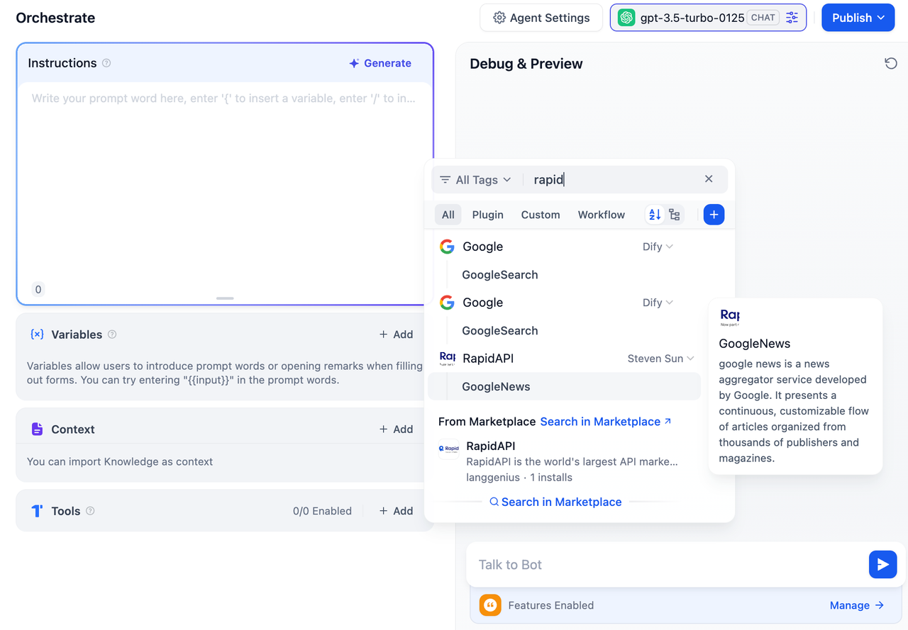

## Overview

**RapidAPI** is the world's largest API marketplace, featuring over 1,000,000 developers and 10,000 APIs. It enables developers to seamlessly connect to a wide range of APIs, offering tools for diverse tasks such as data aggregation, analysis, and automation.

The **GoogleNews** action within **RapidAPI** provides access to aggregated news articles, allowing users to retrieve a continuous, customizable stream of news updates from Google News.

## Configuration

To use **RapidAPI**, follow these steps:

1. **Get a RapidAPI Key** You can go to the [RapidAPI Google News](https://rapidapi.com/bfd-id/api/google-news13/playground/apiendpoint_7a387229-24a0-4185-9be2-ce2791df0d78) website, create a new API Key, and make sure your account has the required permissions to access the desired APIs.

2. **Install the RapidAPI Tool** Open the Plugin Marketplace, search for the RapidAPI tool, and install it to integrate it with your application.

3. **Authorize RapidAPI** In Dify, go to **Plugins > RapidAPI > Authorize**. Enter your API Key to activate the tool.

## Tool Features

The **RapidAPI** tool currently includes the **GoogleNews** action, allowing you to aggregate and retrieve news content efficiently.

### GoogleNews

**Description:** GoogleNews is a customizable news aggregator service developed by Google. It provides a continuous flow of articles organized from various publishers worldwide.

**Parameters:**

* **Language and Region** (String, Required): Specify the language and region for the search results using the "National Language Code Comparison Table" (e.g., `en-US` for English in the US or `zh-CN` for Simplified Chinese).

## Usage

RapidAPI can seamlessly integrate **Chatflow / Workflow Apps** and **Agent Apps**.

### Chatflow / Workflow Apps

1. Add the RapidAPI node to your Chatflow or Workflow pipeline.
2. Configure the **GoogleNews** action by specifying the **Language and Region** parameter.
3. Run the pipeline to retrieve news articles, which can be used in downstream actions or displayed in your app.

### Agent Apps

1. You can add the RapidAPI tool to your Agent application.
2. Send a request to **GoogleNews** by specifying the language and region.
3. The tool processes the request and returns the relevant news content.

## Use Cases

* **News Aggregation:** Retrieve news articles for dashboards, reports, or alerts.
* **Localized Content:** Provide region-specific news in different languages.
* **Trend Analysis:** Collect news data for sentiment analysis or topic detection.
* **Content Automation:** Automate the delivery of fresh news content for websites or applications.

With **RapidAPI**, you can quickly integrate powerful APIs like **GoogleNews** into your workflows, unlocking a wide range of possibilities for data-driven applications.
