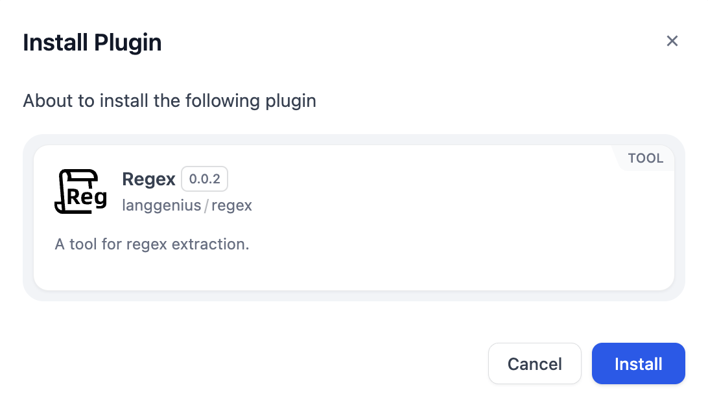

# Overview
The Regex Extract tool is a utility that helps users extract specific patterns of text using regular expressions (regex).

# Configure
1. Install Regex from Dify Marketplace.

2. Fill in Content to be extracted and Regular expression.

