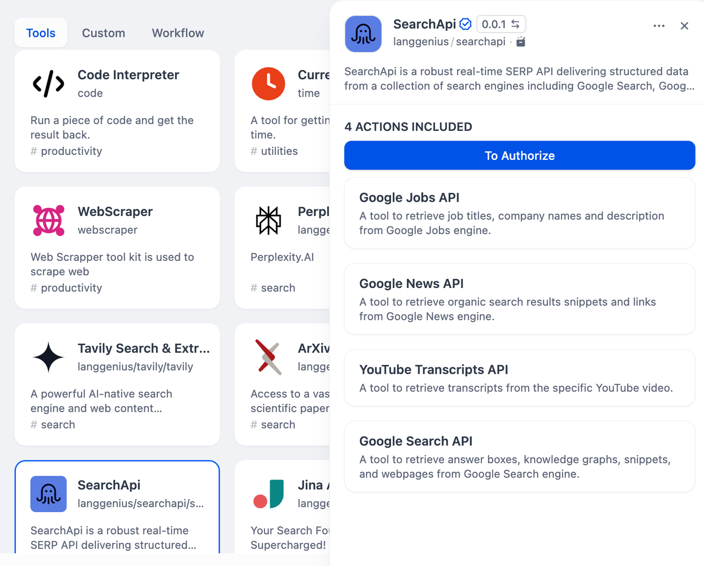
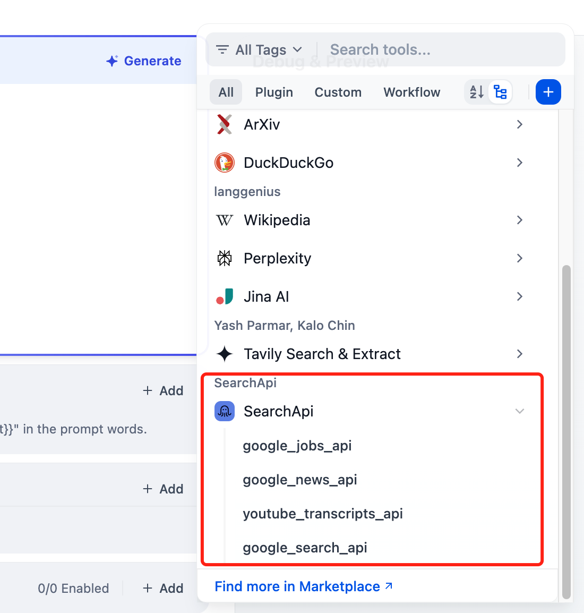

# SearchApi

## Overview

SearchApi is a powerful real-time SERP API that provides structured data from a collection of search engines including Google Search, Google Jobs, YouTube, Google News, and more. Here are the steps to configure and use the SearchApi search tool in Dify.

## Configuration

### 1. Apply for an API Key

Apply for an API Key at [SearchApi](https://www.searchapi.io/).

### 2. Get SearchApi tools from Plugin Marketplace

The SearchApi tools could be found at the Plugin Marketplace, please install it.

### 3. Fill in the configuration in Dify

On the Dify navigation page, go to `Tools > SearchApi > Authentication` to fill in the API Key.

### 4. Using the tool

You can use the SearchApi tool in the following application types.

#### Chatflow / Workflow applications

Both Chatflow and Workflow applications support adding SearchApi series tool nodes, providing four tools: Google Jobs API, Google News API, Google Search API, and YouTube Scraper API.

#### Agent applications

Select the SearchApi tool you need to add in the Agent application, then enter commands to call the tool.