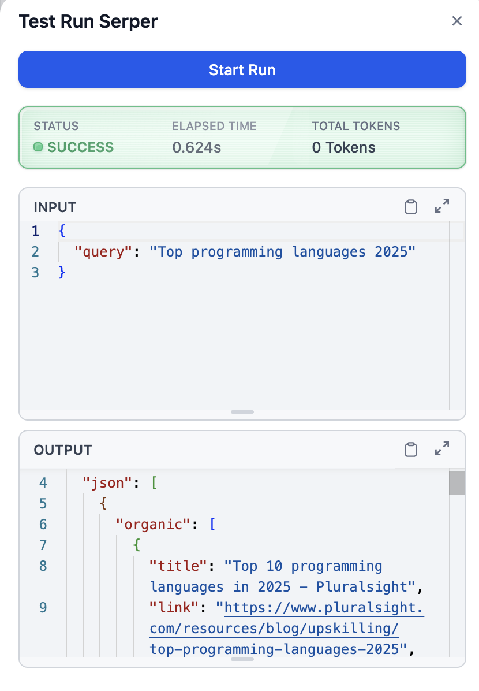

# Overview
[Serper](https://serpapi.com) is a search tool designed to query and retrieve information from the web using a simple and efficient interface. 

It allows users to input a query string and fetch search results programmatically, making it ideal for integrating web search capabilities into workflows or applications. 

With Serper, you can automate the process of retrieving relevant information from the internet without manually using a browser.
# Configure
1. Install Serper from Dify Marketplace.

2. Create an account in Serper and [get an API key](https://serper.dev/api-key).
3. Add Serper to your workflow. Click "To authorize" and paste the API key.
4. Input your query string, such as `Top programming languages 2025`.
