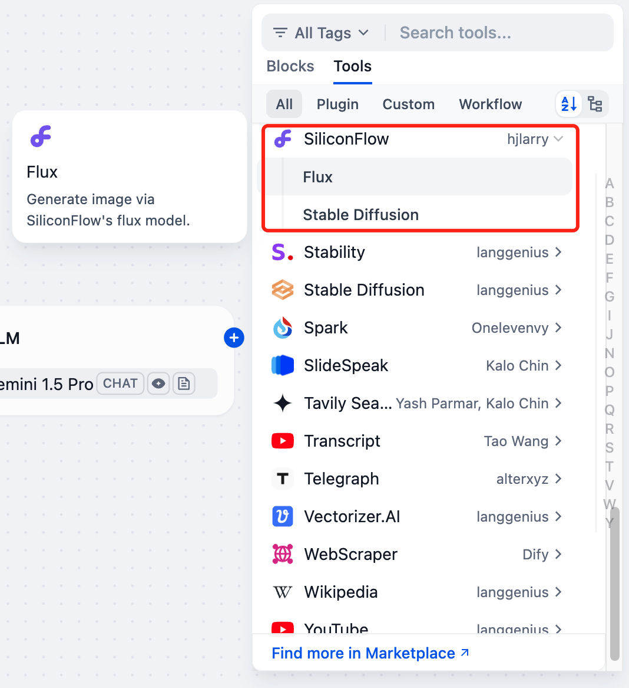

# SiliconFlow

## Overview

SiliconFlow provides high-quality GenAI services based on excellent open-source foundation models. You can use SiliconFlow in Dify to call image generation models like Flux and Stable Diffusion, and build your own AI image generation application.

## Configuration

### 1. Apply for SiliconCloud API Key

Create a new API Key on the [SiliconCloud API management](https://cloud.siliconflow.cn/account/ak) page and ensure that you have sufficient balance.

### 2. Get SiliconFlow tools from Plugin Marketplace

The SiliconFlow tools could be found at the Plugin Marketplace, please install it first.

### 3. Fill in the configuration in Dify

On the Dify navigation page, click `Tools > SiliconFlow > To Authorize` and fill in the API Key.

### 4. Using the tool

You can use the SiliconFlow tool in the following application types:

#### Chatflow / Workflow applications

Both Chatflow and Workflow applications support the SiliconFlow tool node. After adding it, you need to fill in the "Input Variables → Prompt" in the node with variables to reference the user's input prompt or the content generated by the previous node. Finally, use the variable to reference the image output by SiliconFlow in the "End" node.

#### Agent applications

Add the SiliconFlow tool in the Agent application, then send a picture description in the dialog box to call the tool to generate an AI image.

#### About SiliconFlow

SiliconFlow is committed to building a scalable, standardized, and high-performance AI Infra platform. It offers SiliconCloud (the model cloud service platform), SiliconLLM (the LLM inference engine), and OneDiff (the high-performance text-to-image/video acceleration library). These solutions help enterprises and individual users deploy AI models efficiently and cost-effectively.

[Website](https://siliconflow.cn/) | [SiliconCloud](https://cloud.siliconflow.cn/playground/chat) | [Discord](https://discord.gg/3nAMSVJekY) | [X](https://twitter.com/SiliconFlowAI) 
