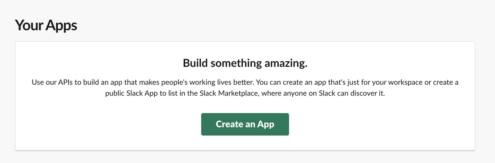
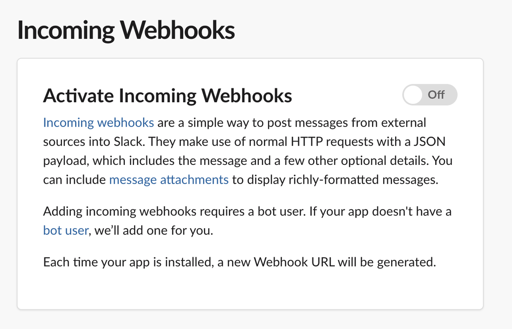

# Overview
Slack is a cloud-based team communication platform designed to enhance collaboration and streamline workflows within organizations. 

You can use the Slack tool to send messages in a channel via a bot with the output variables from Dify workflow.

# Configure
Create an application in Slack
1. Log in to the [Slack API platform](https://api.slack.com/apps).
2. Click **Create an App**.

3. Click **From scratch**.
4. Enter the App Name and select a workspace, then click **Create App**.

5. Go to app settings page. Click **Incoming Webhooks** in the app settings page's left navigation bar. 
6. Enable **Activate Incoming Webhooks**. At the bottom of the page, click Add New Webhook to Workspace and select an app publishing channel.

7. Return to **Incoming Webhooks**, and copy the webhook URL.

## Configure Slack tool
1. Install Slack tool from Marketplace.

2. Add Slack node to workflows.
3. Paste **Incoming Webhook**.