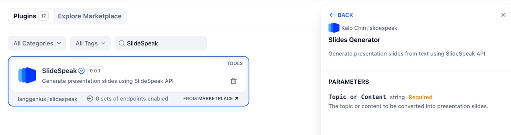
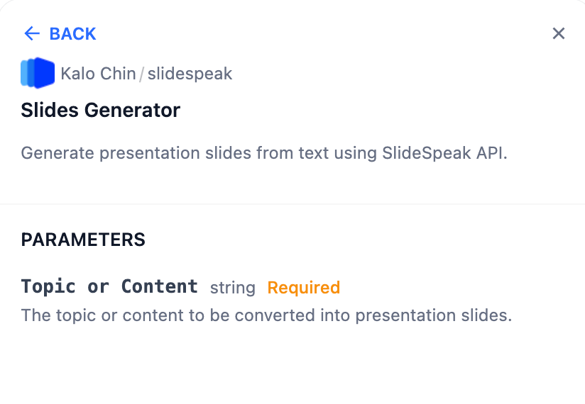
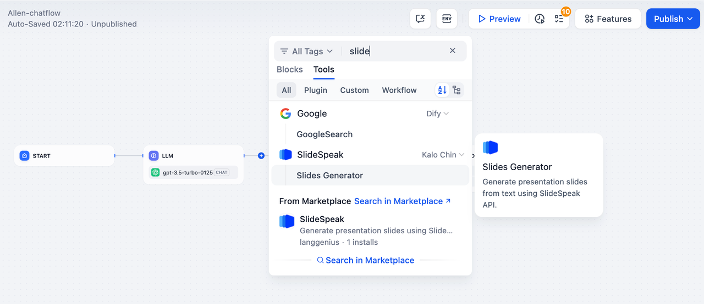
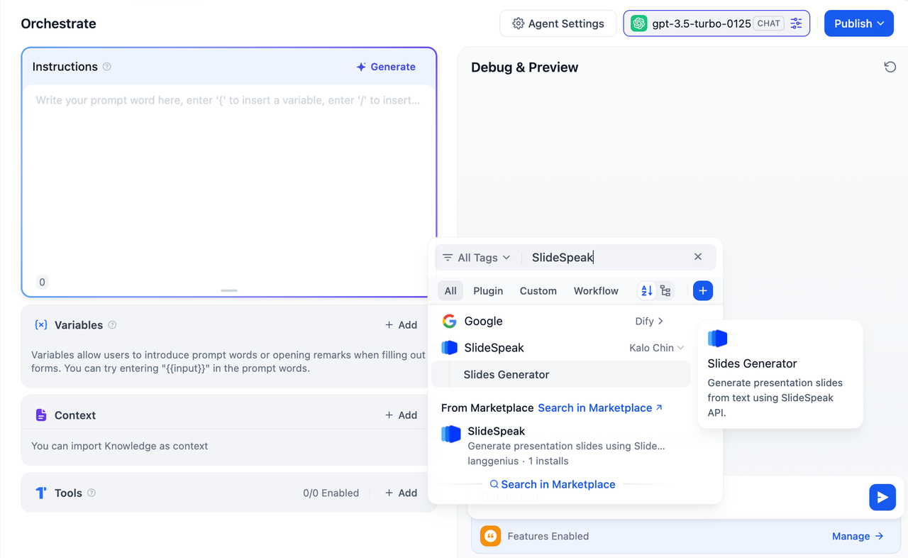

## Overview

**SlideSpeak** is a powerful tool for generating presentation slides from text.

In **Dify**, SlideSpeak streamlines the process of creating visually engaging slides based on the content you provide. Whether you're preparing for meetings, lectures, or pitches, SlideSpeak enables efficient slide creation with minimal effort.

## Configuration

To start using **SlideSpeak**, follow these steps:

1. **Install the SlideSpeak Tool** Open the Plugin Marketplace, search for the SlideSpeak tool, and install it to integrate it with your application.

2. **Get a SlideSpeak API Key** Visit the SlideSpeak platform, create a new API Key, and ensure your account has the necessary permissions to access its features.

3. **Authorize SlideSpeak** In Dify, go to **Plugins > SlideSpeak > To Authorize**. Enter your API Key to activate the tool.

## Tool Features

The **SlideSpeak** plugin includes a single, highly efficient action:

### Slides Generator

Create presentation slides from text-based topics or content.

**Input Variables:**

* **Topic or Content (Required):** Provide the text or topic to be converted into slides.

This action simplifies slide creation by automatically generating layouts, summaries, and key points from your text.

## Usage

**SlideSpeak can seamlessly integrate Chatflow / Workflow Apps and Agent Apps.**

### Chatflow / Workflow Apps

1. Add the SlideSpeak node to your Chatflow or Workflow pipeline.
2. Configure the "Slides Generator" action by specifying the topic or content.
3. Run the pipeline to generate slides and deliver them as part of your workflow.

### Agent Apps

1. Add the SlideSpeak tool to your Agent application.
2. Provide the topic or content via the chat interface.
3. The tool processes your input and returns the generated presentation slides.

## Use Cases

* **Presentations:** Quickly create slides for business meetings, academic lectures, or project pitches.
* **Content Summarization:** Convert long documents or ideas into concise, well-structured slides.
* **Educational Material:** Generate slides for courses, tutorials, or workshops.
* **Idea Sharing:** Create visually engaging slides to present concepts or ideas.

With **SlideSpeak**, you can save time and effort by automating the slide creation process, focusing more on delivering impactful presentations.
