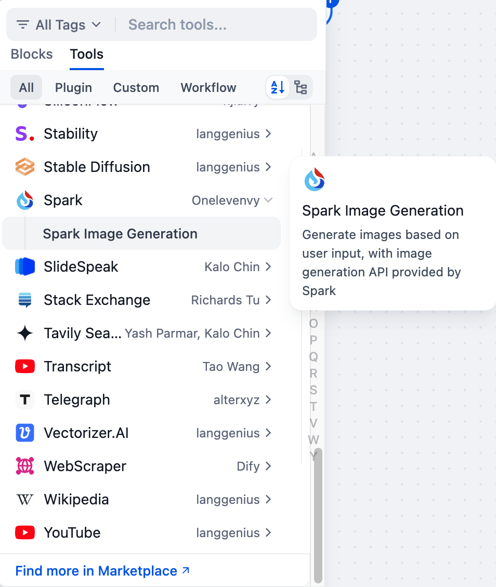

# Apache Spark Tool

## Overview

Apache Spark is an open-source, distributed computing system designed for big data processing and analytics. It provides high-level APIs in Java, Scala, Python, and R, and supports a wide array of data processing tasks, from SQL queries to machine learning and graph processing.

## Configuration

### 1. 1. Apply for Spark API Config
Please apply for an API Key, API Secret and APPID from the [iFLYTEK open platform](https://console.xfyun.cn/services).

### 2. Get Spark tools from Plugin Marketplace
The Apache Spark tools could be found at the Plugin Marketplace, please install it first.

### 3. Fill in the configuration in Dify
On the Dify navigation page, click `Tools > Spark > Authorize` to fill in the API Key.

### 4. Use the tool
You can use the Apache Spark tool in the following application types:

#### Chatflow / Workflow applications
Both Chatflow and Workflow applications support adding an Spark tool node for data processing tasks.

#### Agent applications
Add the Spark tool in the Agent application, then enter data processing commands to call this tool.