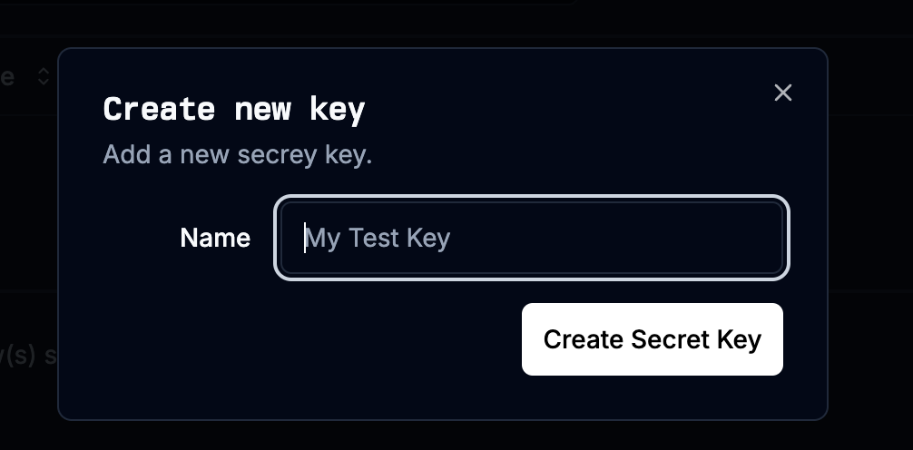

# Overview
Spider is a web crawler for AI agents and LLMs provided by spider.cloud.
## Configure
### Get API Key
1. Create an account in spider.cloud.
2. Add sufficient fund to Spider.
3. Get an [API key](https://spider.cloud/api-keys).

Configure Spider tool
1. Install Spider from Marketplace. 

2. Add Spider node to your workflow.
3. Fill in the Spider API key.