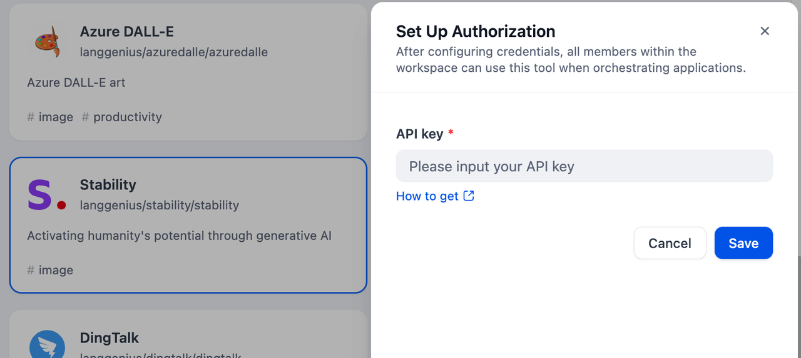
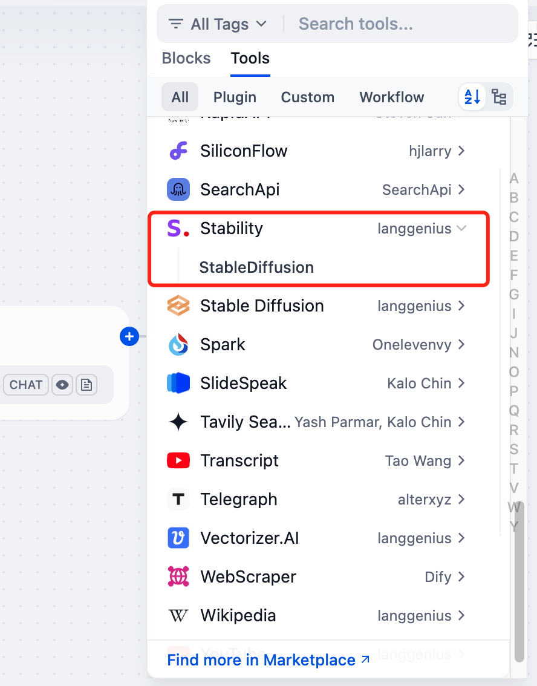

# Stability AI Tool

## Overview

Stability offers a suite of AI tools and models focused on generative media. It provides capabilities for creating images, audio, and video content from text prompts or other inputs. The suite includes various generative models specializing in different artistic styles and media types.

## Configuration

### 1. Apply for Stability API Key
Please apply for an API Key on [Stability.ai](https://platform.stability.ai/account/keys).

### 2. Get Stability tools from Plugin Marketplace
The Stability tools could be found at the Plugin Marketplace, please install it first.

### 3. On the Dify navigation page, click `Tools > Stability > Authorize` and fill in the API key.

### 4. You can use the Stability tool in the following application types.

#### Chatflow / Workflow applications
Both Chatflow and Workflow applications support the Stability tool node.

#### Agent applications
Add the Stability tool in the Agent application, then enter the short text to call this tool and get the image.