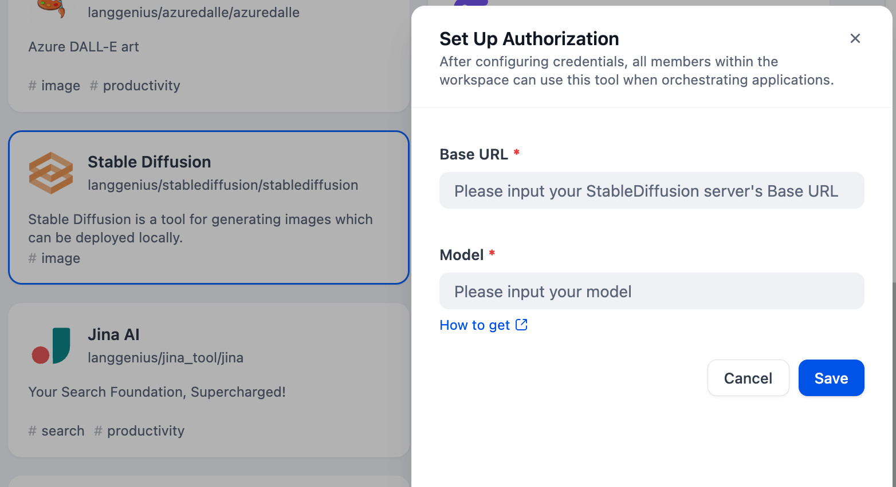
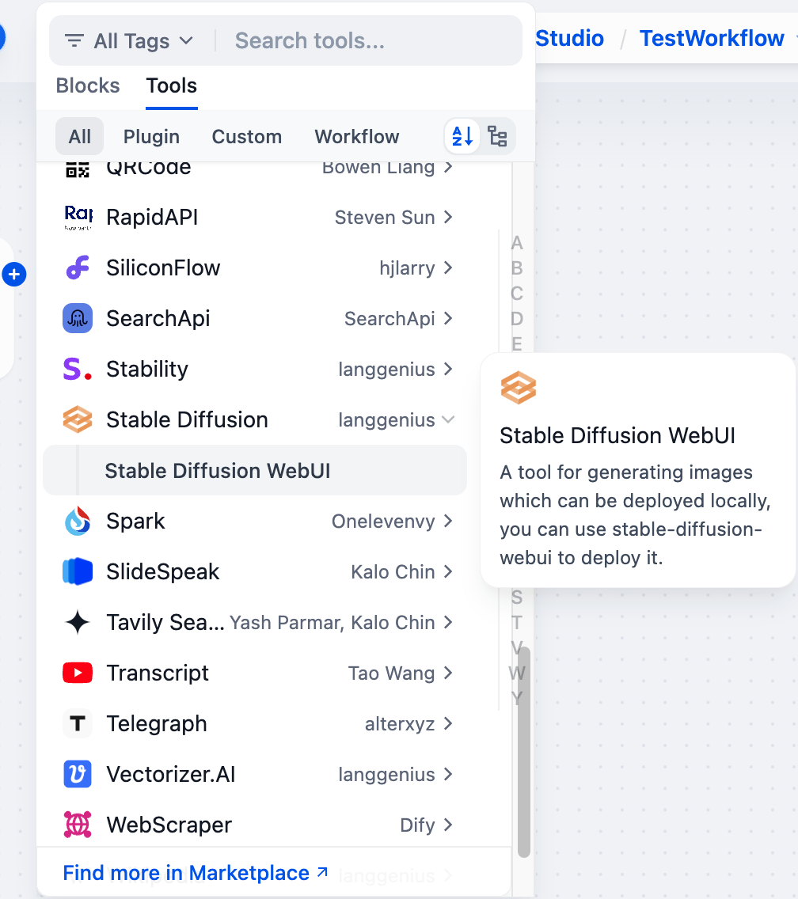

# Stable

## Overview

Stable Diffusion is a tool for generating images based on text prompts. Dify has implemented the interface to access the Stable Diffusion WebUI API, so you can use it directly in Dify. The following are steps to integrate Stable Diffusion into Dify.

## Configuration

### 1. Make sure you have a machine with a GPU

Stable Diffusion requires a machine with a GPU to generate images. However, it's not necessary; you can use CPU to generate images, but it will be slow.

### 2. Launch Stable Diffusion WebUI

Launch the Stable Diffusion WebUI on your local machine or server.

#### 2.1. Clone the Stable Diffusion WebUI repository

Clone the Stable Diffusion WebUI repository from the official repository:
```
git clone https://github.com/AUTOMATIC1111/stable-diffusion-webui
```

#### 2.2. Launch it locally

After cloning the repository, change directory to the cloned repository and run the following command to launch the Stable Diffusion WebUI.

**Windows**
```
cd stable-diffusion-webui
./webui.bat --api --listen
```

**Linux**
```
cd stable-diffusion-webui
./webui.sh --api --listen
```

#### 2.3. Prepare Models

Access the Stable Diffusion WebUI on your browser according to the address shown in the terminal. Download the models from HuggingFace or other sources and put them in the `models` directory of the Stable Diffusion WebUI.

For example, we use [pastel-mix](https://huggingface.co/JamesFlare/pastel-mix) as the model, use `git lfs` to download the model and put it in the models directory in `stable-diffusion-webui`.
```
git clone https://huggingface.co/JamesFlare/pastel-mix
```

#### 2.4 Get Model Name

Now you can see `pastel-mix` in the model list, but we still need to get the model name, visit `http://your_id:port/sdapi/v1/sd-models` to get the model name. You will see output like:

```json
[
    {
        "title": "pastel-mix/pastelmix-better-vae-fp32.ckpt [943a810f75]",
        "model_name": "pastel-mix_pastelmix-better-vae-fp32",
        "hash": "943a810f75",
        "sha256": "943a810f7538b32f9d81dc5adea3792c07219964c8a8734565931fcec90d762d",
        "filename": "/home/takatost/stable-diffusion-webui/models/Stable-diffusion/pastel-mix/pastelmix-better-vae-fp32.ckpt",
        "config": null
    }
]
```

### 3. Get Stable Diffusion tools from Plugin Marketplace

The Stable Diffusion tools could be found at the Plugin Marketplace, please install it first.

### 4. Integrate Stable Diffusion in Dify

Fill in the Authentication and Model Configuration in `Tools > Stable Diffusion > To Authorize` with the information you get from the previous steps.



### 5. Using the tool

You can use the Stable Diffusion tool in the following application types:


#### Chatflow / Workflow Applications

Both Chatflow and Workflow applications support adding `Stable Diffusion` tool nodes. After adding, you need to fill in the variable referencing the user's input prompt or the content generated by the previous node in the "Input Variables → Prompt" section within the node. Finally, use a variable to reference the image output by `Stable Diffusion` in the "End" node.

#### Agent Applications

Add the `Stable Diffusion` tool in the Agent application, then send image descriptions in the chat box to invoke the tool and generate AI images.