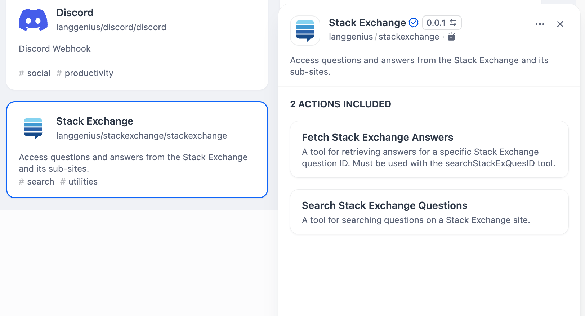
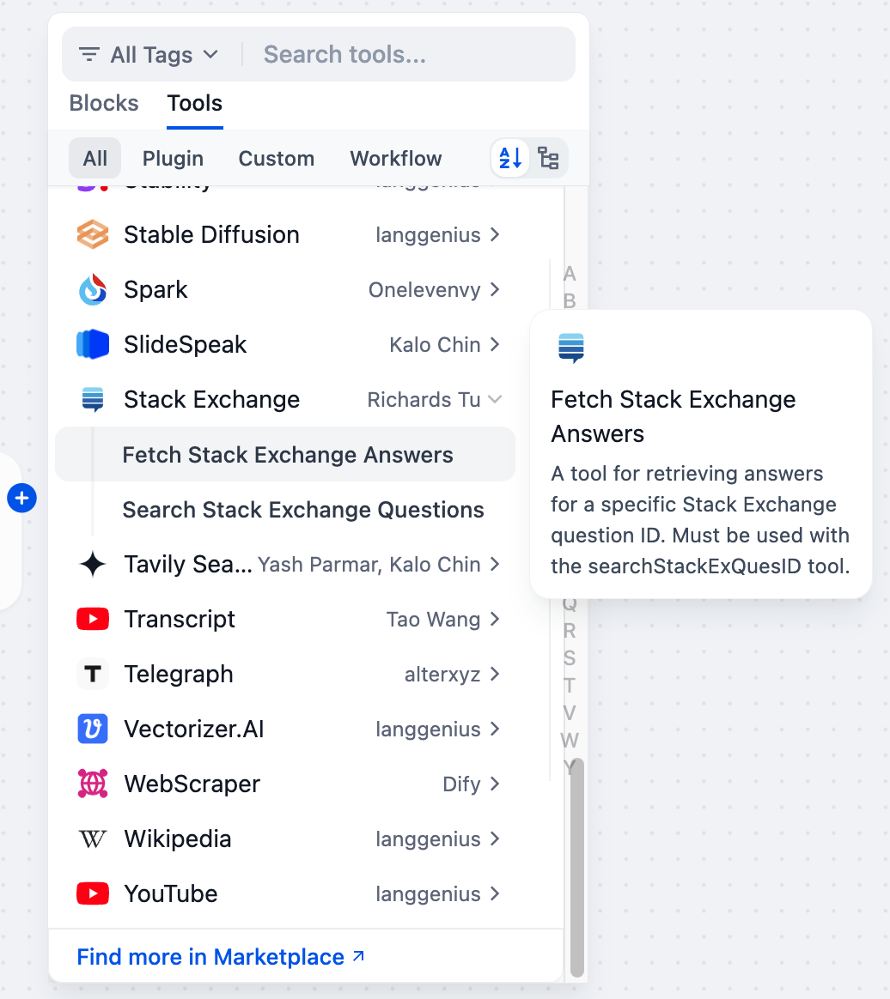

# Stack Exchange API Tool

## Overview

The Stack Exchange API provides programmatic access to the Stack Exchange network, enabling users to fetch answers and search questions across various communities, including Stack Overflow. 

## Configuration

### 1. Get Stack Exchange tools from Plugin Marketplace

The Stack Exchange tools could be found at the Plugin Marketplace, please install it first.

### 2. You can use the Stack Exchange tool in the following application types.

#### Chatflow / Workflow applications
Both Chatflow and Workflow applications support adding a Stack Exchange tool node.

#### Agent applications
Add both `fetchAnsByStackExQuesID` and `seahStackExQuestions` of the Stack Exchange tool in the Agent application, then enter the search keyword to call this tool.