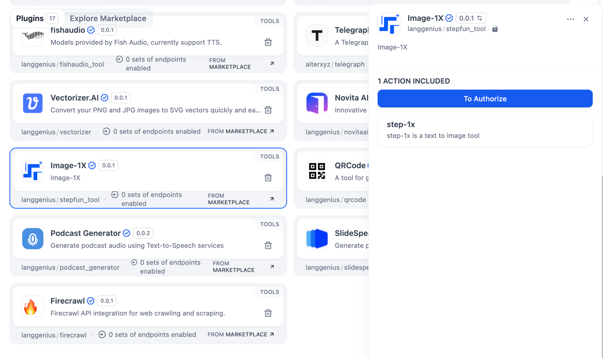
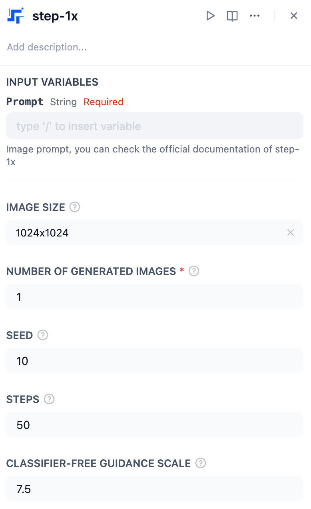
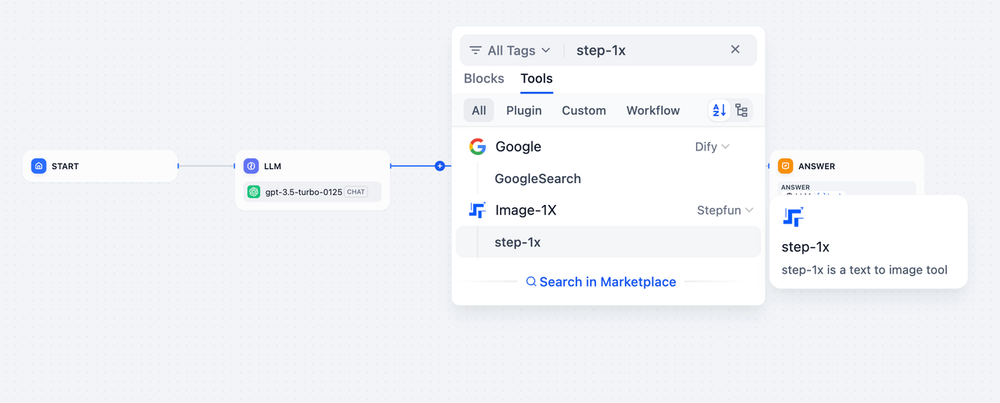
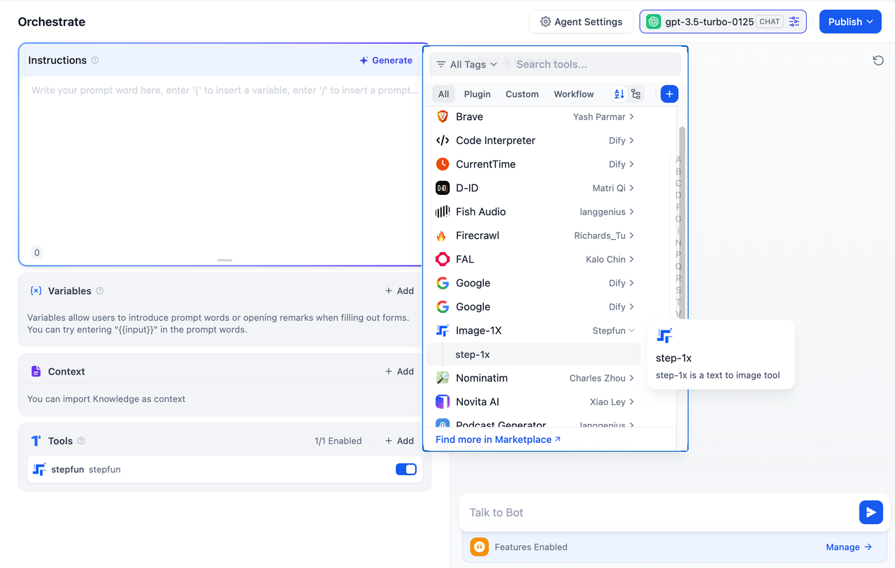

## Overview

**Image-1X** is a text-to-image generation tool powered by AI. With **step-1x**, a text-to-image tool, you can effortlessly transform text prompts into stunning visuals. This tool is ideal for creative projects, visual storytelling, and generating unique images based on textual descriptions.

## Configuration

To start using **Image-1X**, follow these steps:

1. **Install Image-1X Tool**
Access the Plugin Marketplace and install the Vectorizer.AI tool.

2. **Apply for a Image-1X API Key**
Go to the Image-1X API Keys page, create a new API Key, and ensure your account has sufficient balance.

3. **Authorize Image-1X**
Navigate to **Tools > Image-1X > To Authorize** in your application and provide API Key ID and Secret to activate the plugin.



Stepfun base URL:

```text
https://platform.stepfun.com/console-tools
```

## Tool Feature

The **step-1x** action generates an image from the provided text prompt using advanced AI capabilities.

### step-1x Action

**Prompt** (*String, Required*):
* Description: A textual description of the desired image. This is the main input for generating the image.
* Example: *"A futuristic cityscape at sunset with flying cars."*

**Image Size** (*String*):
* Description: Specifies the dimensions of the output image.
* Default: `1024x1024`
* Options: Choose the size depending on your project needs (e.g., `512x512`, `1024x1024`).

**Number of Generated Images** (*Integer, Required*):
* Description: The number of images generated in a single run.
* Default: `1`
* Example: Set to `2` to generate two variations of the image from the same prompt.

**Seed** (*Integer*):
* Description: Sets the seed value for reproducibility. Using the same seed with the same prompt will produce identical results.
* Default: `10`
* Example: Change the seed value for diverse outputs.

**Steps** (*Integer*):
* Description: The number of inference steps used during image generation. Higher values improve image quality but increase processing time.
* Default: `50`
* Example: Use `25` for faster results or `100` for finer details.

**Classifier-Free Guidance Scale** (*Float*):
* Description: Controls how strongly the tool follows the given prompt. Higher values make the result more aligned with the prompt but may reduce creativity.
* Default: `7.5`
* Range: Adjust values between `1.0` (less focused) and `15.0` (highly focused).



## Usage

Image-1X can seamlessly integrate **Chatflow / Workflow Apps** and **Agent Apps**.

### Chatflow / Workflow Apps

1. Add the Image-1X node to your Chatflow or Workflow pipeline.
2. Input the text prompt into the node configuration.
3. Execute the pipeline to generate the image, which can be used or displayed as part of your application's workflow.



### Agent Apps

1. Add the Image-1X tool to your Agent application.
2. Send a text prompt via the chat interface to describe the image you want to create.
3. The tool will process the prompt and return the generated image in real time.



## Use Cases

* **Creative Content**: Generate artwork, illustrations, or concept designs based on descriptive text.
* **Storytelling**: Visualize scenes, characters, or settings for narratives or presentations.
* **Marketing and Branding**: Create unique visual assets for campaigns or advertisements.
* **Prototyping**: Quickly generate visual references for design or creative projects.

Image-1X simplifies the process of image generation, allowing you to bring their ideas to life with just a text prompt.
