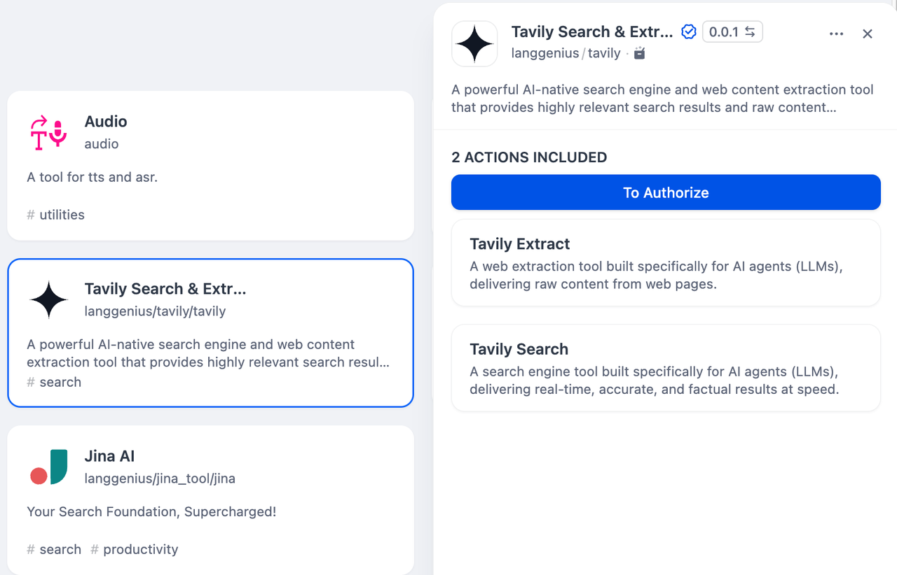
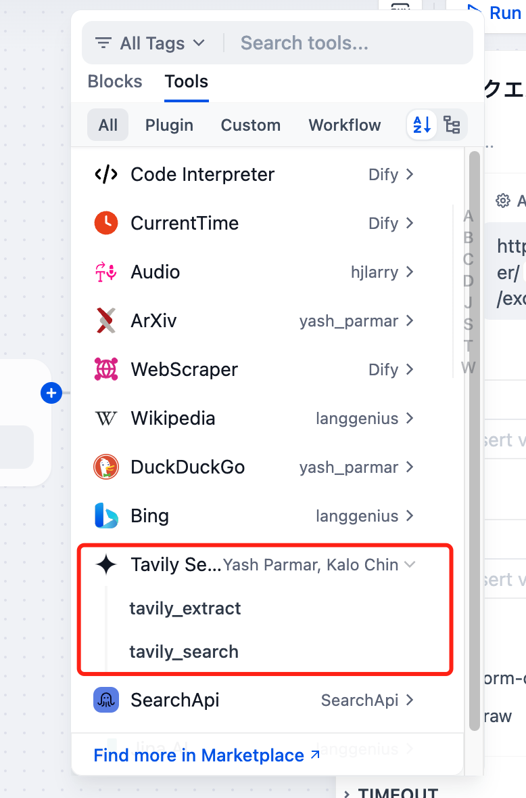
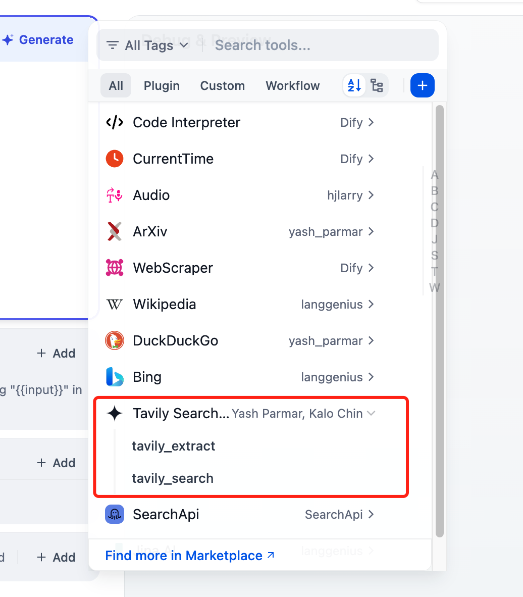

# Tavily

## Overview

Tavily is a search API designed for AI agents and applications, offering precise and context-aware search results. It handles complex search queries and extracts relevant information from the web, providing structured output.

## Configuration

### 1. Apply for an API Key

Apply for an API Key at [Tavily](https://app.tavily.com/home).

### 2. Get Tavily tools from Plugin Marketplace

The Tavily tools could be found at the Plugin Marketplace, please install it.

### 3. Fill in the configuration in Dify

On the Dify navigation page, go to Tools > Tavily > Authentication to fill in the API Key.

### 4. Using the tool

You can use the Tavily tool in the following application types:

#### Chatflow / Workflow applications

Both Chatflow and Workflow applications support adding Tavily series tool nodes, providing two tools: extract and search.

#### Agent applications

Select the Tavily tool you need to add in the Agent application, then enter commands to call the tool.