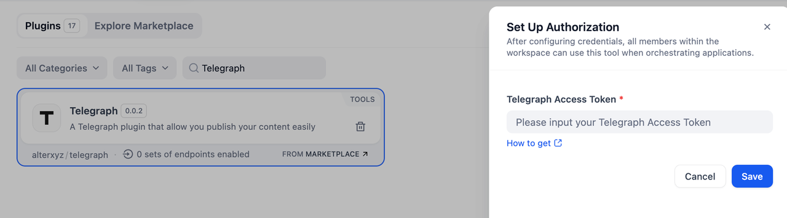
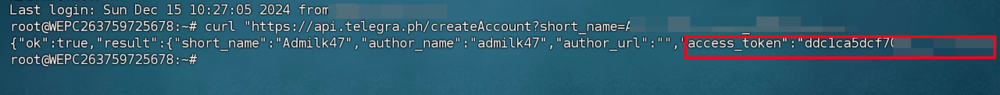
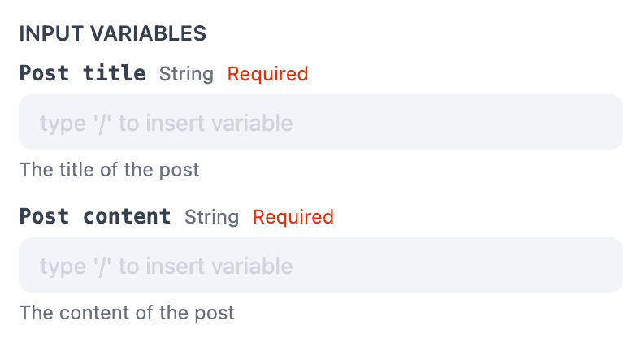
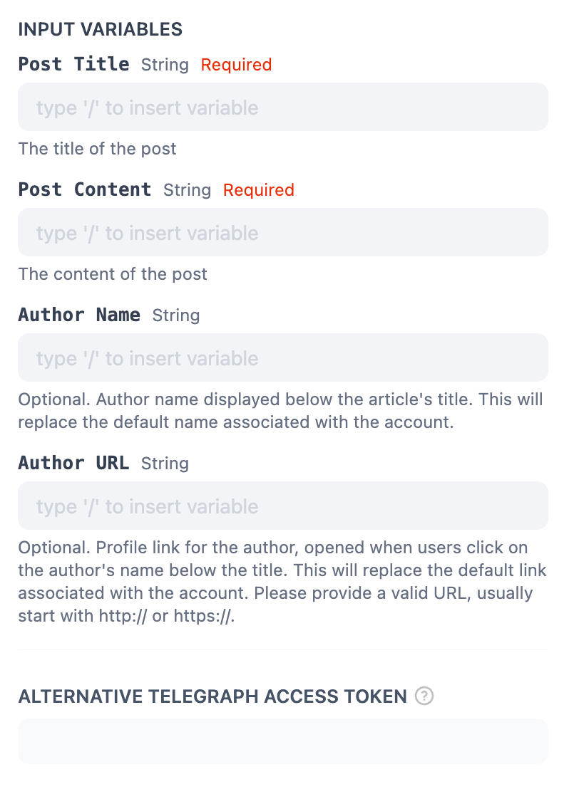
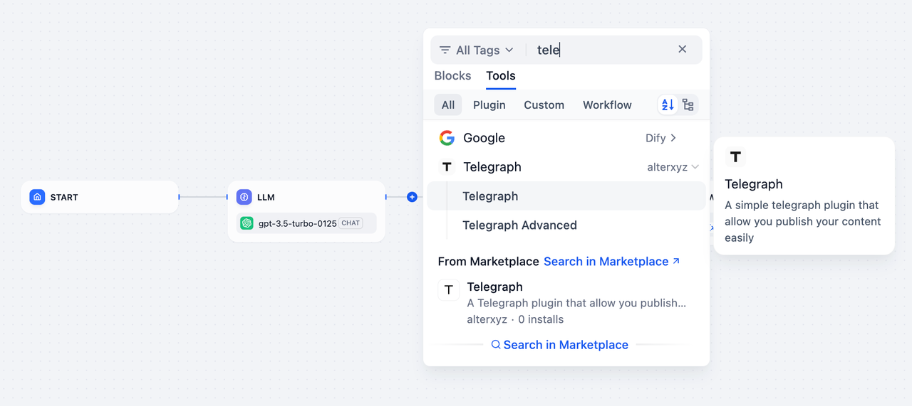
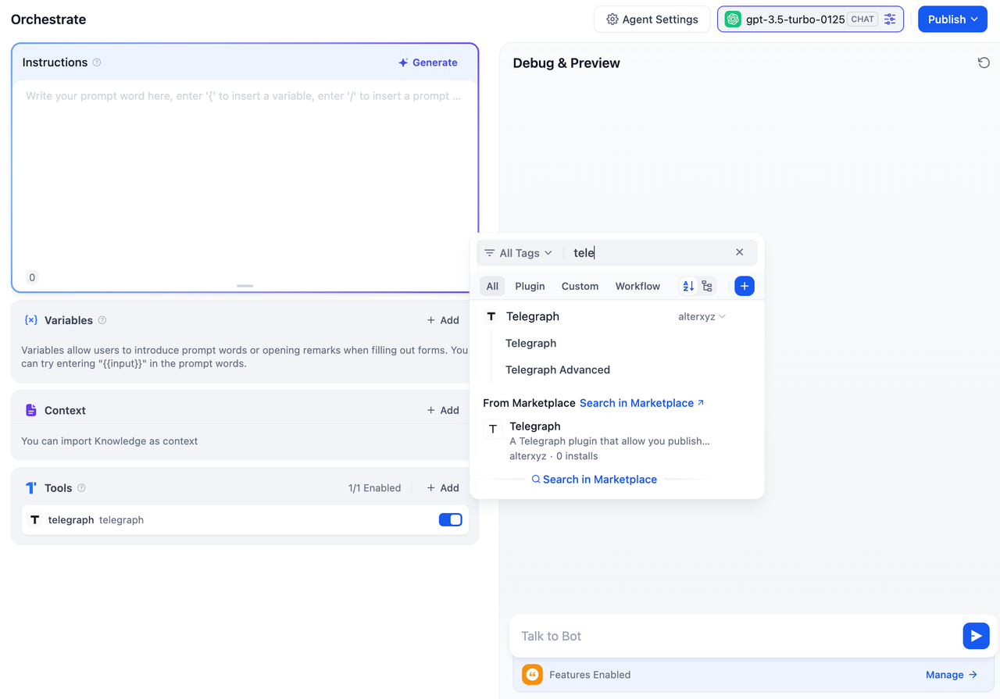

## Overview

**Telegraph** is a simple yet powerful plugin that allows you to create richly formatted posts and publish them on the web with just one click. **Telegraph** posts also get beautiful [Instant View](https://telegram.org/blog/instant-view) pages on **Telegram**.

This means you can automatically publish results generated by Dify Apps to Telegraph, turning them into publicly accessible internet content.

## Configuration

To set up Telegraph, follow these steps:

1. **Install Telegraph Tool**
Access the Plugin Marketplace and install it.

2. **Apply for a Telegraph API Key**
Go to the [Telegraph API Keys](https://telegra.ph/api#createAccount) page, create a new API Key, and ensure your account has sufficient balance.

3. **Authorize Telegraph**
Navigate to **Plugins > Telegraph > To Authorize** in Dify, and input your API Key to enable the tool.

You need to request a URL to get your Telegraph pages' access API. For more details about Telegraph, please check it here.

## Usage

### Telegraph

The basic Telegraph action enables you to publish content with minimal setup. Ideal for users who want a fast and straightforward publishing experience. Input your **Post title / Post content** to publish it directly.

### Telegraph Advanced

The advanced mode allows for more control over the publishing process, including:

* **Post Title** (*String, Required*): Define the title of the post. This is a mandatory field that will appear as the headline of your published content.
* **Post Content** (*String, Required*): Add the main body of the post. This is a required field containing the core content to be published.
* **Author Name** (*String, Optional*): Specify the name of the author to display below the article's title. If provided, this will override the default author's name associated with the account.
* **Author URL** (*String, Optional*): Provide a URL to link the author's name. This link will open when users click on the author's name below the title. If provided, it replaces the default profile link. Ensure the URL starts with `http://` or `https:/`
* **Alternative Telegraph Access Token** (*String, Optional*): Use a different Telegraph access token for this specific post. This allows you to post under an account other than the default one associated with the tool.

## Usage

Telegraph can seamlessly integrate **Chatflow / Workflow Apps** and **Agent Apps**.

### Chatflow / Workflow Apps

1. Add the Telegraph node to your Chatflow or Workflow pipeline.
2. Select either the **Telegraph** or **Telegraph Advanced** action, depending on your needs.
3. Input the content and configure additional settings (for Telegraph Advanced).
4. You can go ahead and execute the pipeline to publish the content directly.

### Agent Apps

Telegraph can be seamlessly integrated into an Agent App to enable dynamic, real-time content publishing:

1. Add the **Telegraph** tool to the Agent application.
2. Input the post title, author name, and content directly into the chat.
3. The LLM will publish the content on Telegraph as you instructed and provide a URL linking to the online document.

This streamlined process ensures fast and effective publishing, making your content available online.

## Use Cases

* **Quick Content Sharing**: Use Telegraph for fast, minimal-effort publishing of blog posts, announcements, or updates.
* **Customizable Publishing**: Leverage Telegraph Advanced for personalized layouts, metadata, or integration with external systems.
* **Automation**: Integrate Telegraph into workflows for automated content generation and publication.
