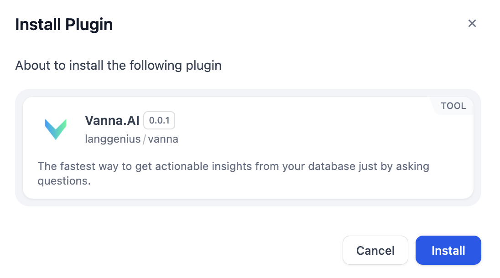

# Overview
Vanna.ai is an innovative AI-driven platform designed to simplify the interaction between users and complex SQL databases. 

# Configure
## Get API Key
1. Create an account and login to Vanna.ai.
2. Copy API key from API Keys.

## Configure Vanna.AI tool
1. Install Vanna.AI from Marketplace. 

2. Add Vanna.AI node to your workflow.
3. Fill in the Vanna.AI API key.
4. Fill in the database configurations.
