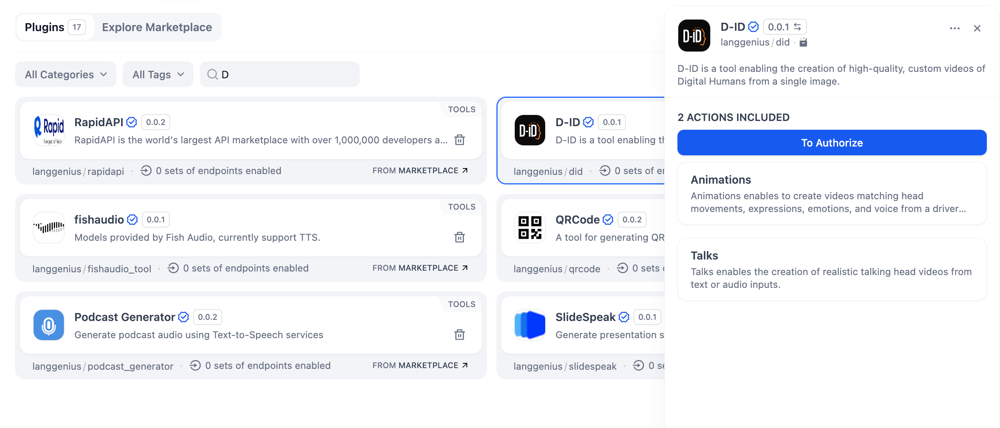
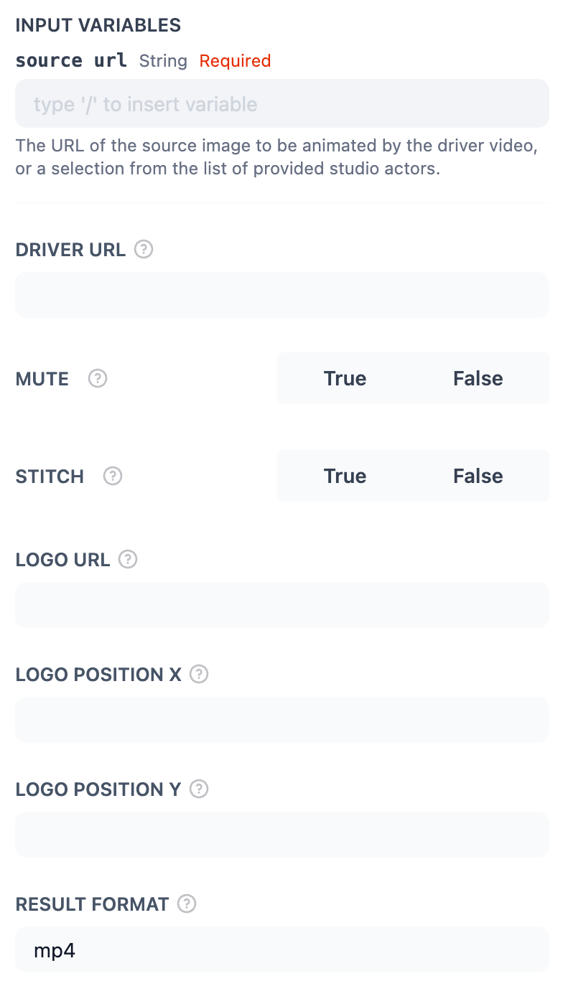
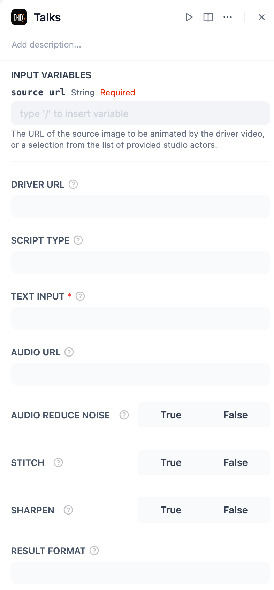

## Overview

**D-ID** is an innovative tool that enables the creation of high-quality, custom videos of Digital Humans from a single image.

In **Dify**, D-ID allows you to bring your visuals to life by animating facial movements and creating realistic talking head videos, making it an excellent choice for storytelling, presentations, and interactive content.

---

## Configuration

To start using **D-ID**, follow these steps:

1. **Install the D-ID Tool** Open the Plugin Marketplace, search for the D-ID tool, and install it to integrate it with your application.

2. **Get a D-ID API Key** Visit the D-ID platform, create a new API Key, and ensure your account has the necessary permissions to access its features.

3. **Authorize D-ID** In Dify, go to **Plugins > D-ID > Authorize**. Enter your API Key to activate the tool.

## Tool Features

The **D-ID** plugin provides two robust actions with various configurable options:

### Animations

Generate videos matching head movements, expressions, and emotions by using a video or an image.

**Input Variables:**

* **Source URL (Required):** The URL of the source image to animate.
* **Driver URL:** The URL of the driver video to guide the animation.
* **Mute:** Choose whether to mute the audio in the output (`True` or `False`).
* **Stitch:** Enable or disable stitching for smoother transitions (`True` or `False`).
* **Logo URL:** Add a custom logo overlay on the video.
* **Logo Position (X, Y):** Specify the coordinates for the logo placement.
* **Result Format:** Choose the desired output format (e.g., `mp4`).

### Talks

Create realistic talking head videos from text or audio inputs.

**Input Variables:**

* **Source URL (Required):** The URL of the source image to animate.
* **Script Type:** Define the input type (`text` or `audio`).
* **Text Input (Required for text script):** Enter the text to be spoken.
* **Audio URL:** Provide the URL of the audio file for synchronization.
* **Audio Reduce Noise:** Enable noise reduction for clearer audio (`True` or `False`).
* **Stitch:** Enable or disable stitching for smoother transitions (`True` or `False`).
* **Sharpen:** Apply sharpening for a crisper image (`True` or `False`).
* **Fluent:** Ensure fluent lip-syncing (`True` or `False`).
* **Pad Audio:** Specify additional audio padding.
* **Driver Expressions:** Adjust the driver video's expressions.
* **Result Format:** Choose the desired output format (e.g., `mp4`).

## Usage

**D-ID can seamlessly integrate Chatflow / Workflow Apps and Agent Apps.**

### Chatflow / Workflow Apps

1. Add the D-ID node to your Chatflow or Workflow pipeline.
2. Configure the action (e.g., Animations or Talks) by providing the required source URL and other inputs.
3. Run the pipeline to generate animations or talking head videos as part of your workflow.

### Agent Apps

1. Add the D-ID tool to your Agent application.
2. Send the source URL along with the required input (e.g., text, audio) via the chat interface.
3. The tool processes your input and returns the generated video.

## Use Cases

* **Storytelling:** Create animated or talking videos to enhance narratives or interactive experiences.
* **Marketing and Presentations:** Generate engaging videos for campaigns or professional presentations.
* **Education and Training:** Produce realistic videos for e-learning content or tutorials.
* **Virtual Assistants:** Build lifelike digital avatars for customer interactions or AI-driven services.

With **D-ID**, you can transform static images into dynamic, engaging videos, enhancing your content's impact and accessibility.
