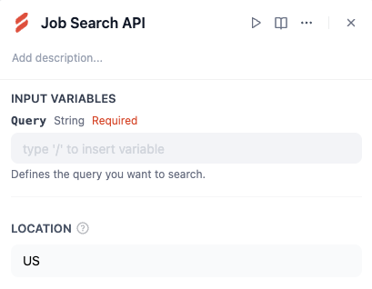
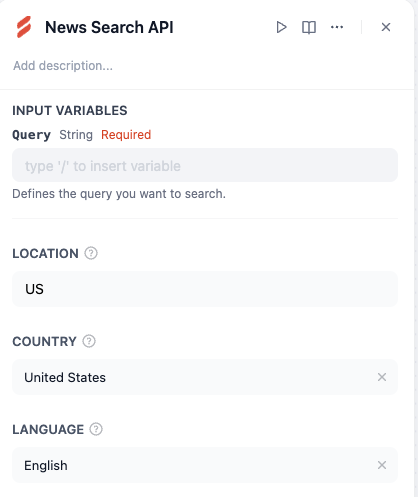
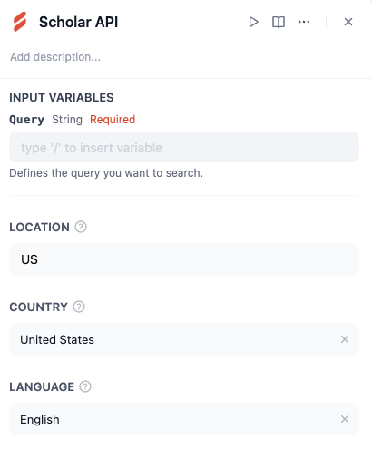
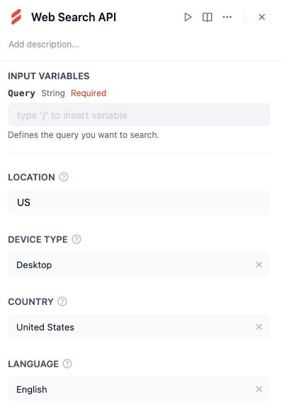
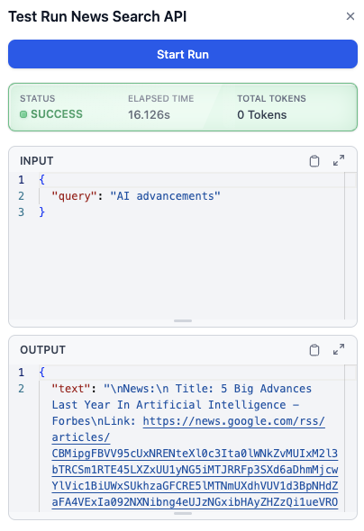

# Overview

The **Serply.io** plugin in Dify provides a comprehensive suite of tools for performing various types of web searches and retrieving structured data. These tools allow users to query for markdown content, job listings, news articles, academic research, and general web search results. By integrating Serply.io into your workflows, you can automate data retrieval tasks and enhance productivity.​

# Tools Included:

1. Get Markdown API: Retrieve markdown content from a specified URL.

2. Job Search API: Search for job listings based on a query.

3. News Search API: Fetch news articles based on a search term, with options to specify location, country, and language.​

4. Scholar API: Search for academic research or scholarly articles using a query, with options to filter by location, country, and language.​

5. Web Search API: Perform general web searches for any query.

# Configure

## 1. Install the Plugin

1. Go to the **Dify Marketplace**.​

2. Search for the **Serply.io Plugin**.

3. Click "Install" to add the plugin to your workspace.

## 2. Register and Obtain API Key

1. Visit [Serply.io](https://serply.io/) to sign up for Serply.io and create an account if you don’t already have one.

2. Log in to your Serply.io account and generate an API Key from the dashboard.

## 3. Authorize the Plugin

1. Add any of the Serply.io tools (e.g., "News Search API") to your workflow in Dify.

2. Click on the "To authorize" button in the tool configuration panel.

3. Enter your Serply.io API Key in the provided field.

4. Save your credentials to complete the authorization process.

## 4. Input Variables

Each tool requires specific input variables:

### Get Markdown API

URL (String, Required): The URL of the webpage you want to retrieve markdown content from.​

Location (Optional): Defines where you want the request to originate (e.g., "US"or "New York").​

### Job Search API​

Query (String, Required): The keyword or phrase defining the type of jobs you want to search for.​

Location (Optional): Defines where you want the search to originate.

### News Search API​

Query (String, Required): The keyword or phrase defining the type of news articles you want to search for.​

Location (Optional): Defines where you want the search to originate.

Country (Optional): Specify a country filter (e.g., "United States").

Language (Optional): Specify a language filter (e.g., "English").

### Scholar API​

Query (String, Required): The keyword or phrase defining the type of academic research or scholarly articles you want to search for.​

Location (Optional): Defines where you want the search to originate.

Country (Optional): Specify a country filter (e.g., "United States")

Language (Optional): Specify a language filter (e.g., "English").

### Web Search API

Query (String, Required): The keyword or phrase defining what you want to search for on the web.​

Location (Optional): Defines where you want the search to originate.

## Example Workflow

1. Add the "News Search API" tool to your workflow in Dify.

2. Input:

° Query: "AI advancements"

。Country: "United States"

。 Language: "English"

3. Run the tool to retrieve a list of relevant news articles about Al advancements from U.S.-based sources in English.

