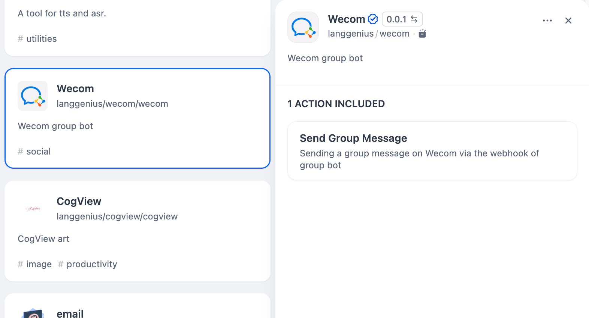

# WeCom

## Overview

WeCom (formerly WeChat Work) is a communication and collaboration platform designed for businesses. It provides features like instant messaging, group chats (including the ability to send group messages), video conferencing, and work calendars.

## Configuration

### 1. Create a WeCom Group Robot and get Webhook Key

1. Login to WeCom and click the "Group Tools" from the upper right corner from one group chat page.

2. Click the "Add Group Robot" button.

3. Enter the robot's name, and click "Add Robot" from the pop-up box.

4. Copy the Webhook URL

### 2. Get WeCom tools from Plugin Marketplace
The WeCom tools could be found at the Plugin Marketplace, please install it.

### 3. Using the tool
You can use the WeCom tool in the following application types.

#### Chatflow / Workflow applications
Both Chatflow and Workflow applications support adding a WeCom tool node and fill in the Webhook Key.

#### Agent applications
Add the WeCom tool in the Agent application, then enter the Webhook Key, and send the group message to call the tool.