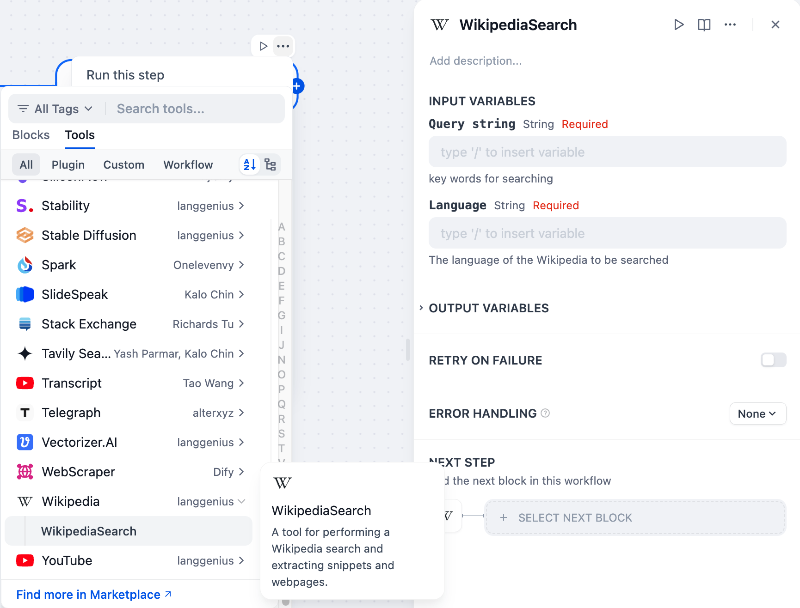

# Wikipedia Tool

## Overview

Wikipedia is a free, open-source online encyclopedia that provides a vast repository of information. It offers a powerful search functionality that enables users to find articles on various topics. Wikipedia tool also allows for programmatic access, facilitating the extraction of article snippets and entire webpages.

## Configuration

### 1. Get Wikipedia tools from Plugin Marketplace
The Wikipedia tools could be found at the Plugin Marketplace, please install it first.

### 2. Use the tool
You can use the Wikipedia tool in the following application types.

#### Chatflow / Workflow applications

Both Chatflow and Workflow applications support adding Wikipedia tool nodes.

#### Agent applications

Add the Wikipedia tool in the Agent application, then enter the online search command to call this tool.