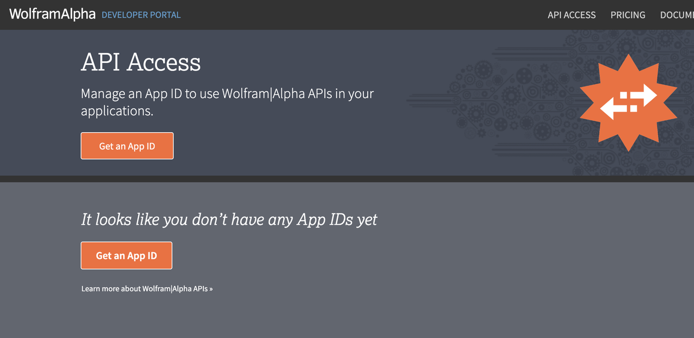
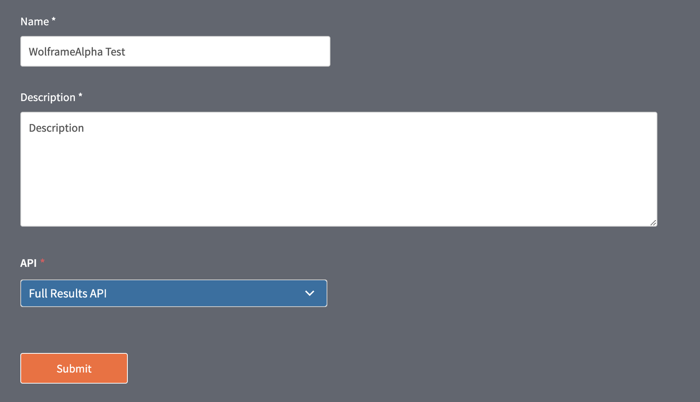
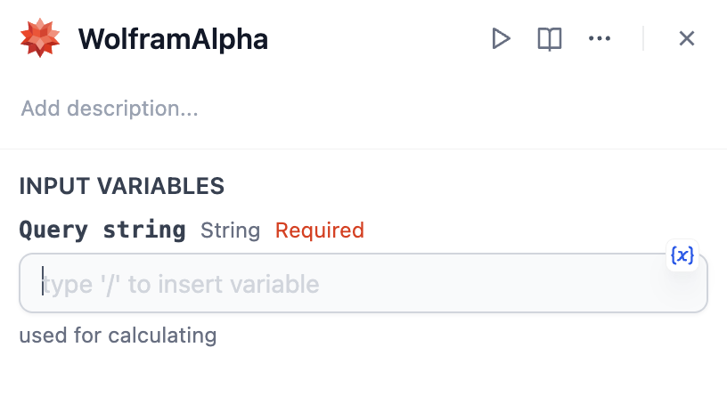

# Overview
Wolfram Alpha is a computational knowledge engine and popular web service that generates answers by computing the relevant data, rather than searching the web for likely hits. Unlike traditional search engines that return a list of web pages, Wolfram Alpha provides a more structured and integrated approach to finding and presenting information.

# Configuration
## Create an App in WolframAlpha
1. Log in to [WolframAlpha Developer Portal](https://developer.wolframalpha.com/access). Please register an WolframAlpha account if you don't have one.
2. Click **Get an App ID**.

3. Fill in the Name and Description. Select **Full Results API** in API.

4. Copy **APP ID**.

## Configure WolframAlpha tool

1. Install WolframAlpha from Marketplace. 
2. Add WolframAlpha node to your workflow.
3. Fill in the WolframAlpha AppID.
4. Input Query string for calculation. Please refer to [WolframAlpha's documentation](https://products.wolframalpha.com/api/documentation) for further help. 

