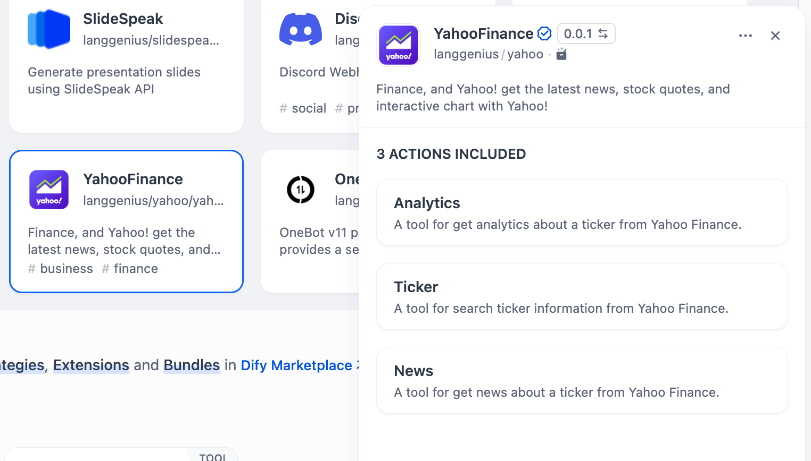
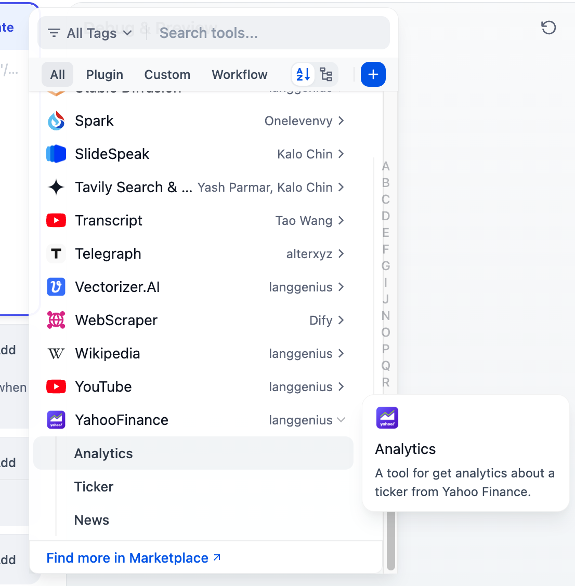

# Yahoo Finance

## Overview

The Yahoo Finance is a service that provides access to real-time and historical stock market data. It enables users to fetch various types of stock information, such as price quotes, historical prices, company profiles, and financial news. The API offers structured data, allowing developers to integrate market data into their applications and analysis tools.

## Configuration

### 1. Get YahooFinance tools from Plugin Marketplace

The YahooFinance tools could be found at the Plugin Marketplace, please install it.

### 2. Using the tool

You can use the `YahooFinance` tool in the following application types:

#### Chatflow / Workflow applications

Both Chatflow and Workflow applications support adding one of the `YahooFinance` tool nodes.

#### Agent applications

Add one of the `YahooFinance` tools in the Agent application, then enter online search instructions to call this tool.