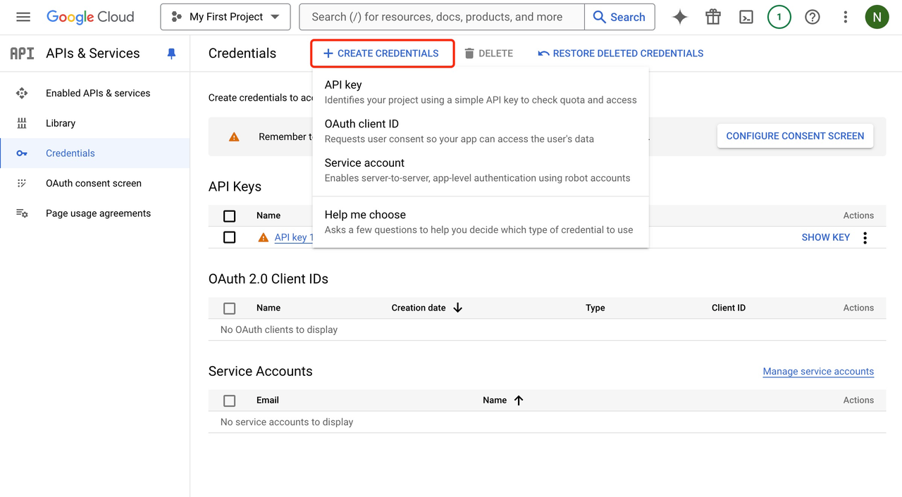
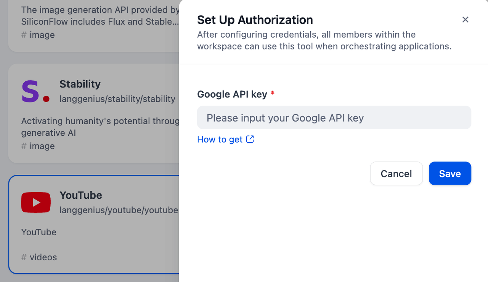
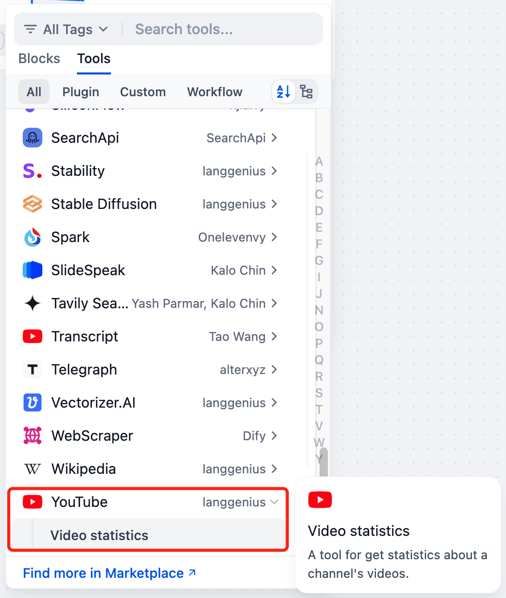

# YouTube

## Overview

[YouTube](https://www.youtube.com/) is the biggest online video sharing platform. Currently, Dify.ai has two relevant tools: `Video Statistics` to analyse the videos' information by entering the URL or keyword.

## Configuration

### 1. Apply for YouTube API Key

Ensure that you are allowed to use Google Cloud Service

> If you don't have an account, go to the [Google credential site](https://console.cloud.google.com/apis/credentials) and follow their instructions to create an account.

If you have the account, go to the APIs & Services page and click `Create credentials -> API key` to create an API key.

Follow the step and click `Enabled APIs and services -> YouTube Data API v3` to enable the YouTube Data API.

### 2. Setup the YouTube API in the Dify Tool page

On the Dify navigation page, click `Tools > Youtube > To Authorize` to fill in the API Key.

### 3. Using the tool

You can use the YouTube tool in the following application types:

#### Chatflow / Workflow applications

Both Chatflow and Workflow applications support adding **Video statistics** nodes. 

#### Agent applications

Add the **Video statistics** tool in the Agent application, then enter relevant commands to invoke this tool.